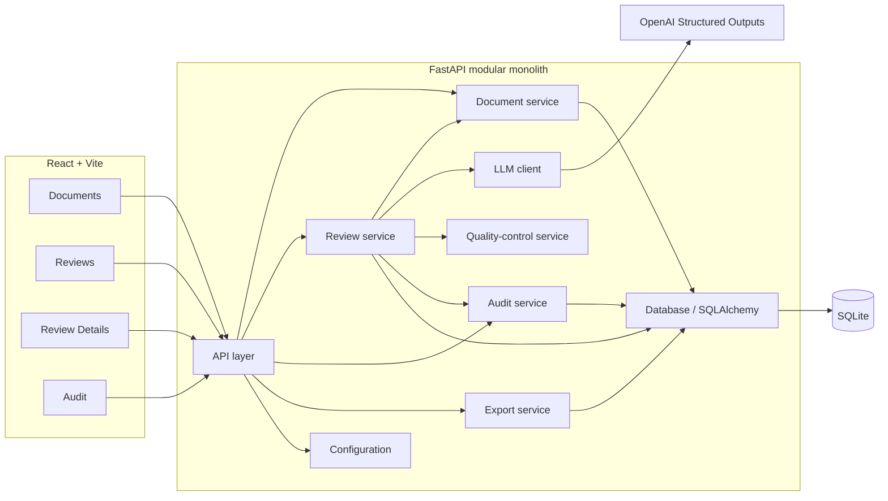

# Architecture

## System purpose and users

**AI Specification Review & Risk Assistant** is a web application that reviews technical specifications, project requirements, feature requests, automation briefs, and business requirements.

The system:

- identifies risks, missing requirements, and contradictions;
- generates questions for the client;
- generates measurable acceptance criteria;
- uses strict LLM structured output;
- applies deterministic backend validation after the LLM response;
- marks uncertain or invalid results with `needs_review=true`;
- records every key action in `audit_runs`;
- returns a safe fallback instead of inventing information.

Primary users for the MVP are analysts, product owners, and engineers who paste or store specification text and inspect review results locally. The product is **not** LegalTech-specific and must **not** be described as a contract-review system.

## Architectural style

The MVP is a **modular monolith**:

- one FastAPI process owns API, services, persistence, LLM calls, quality control, audit, and export;
- one React + Vite frontend talks to that API over HTTP;
- one SQLite database stores documents, reviews, and audit runs.

A modular monolith is used because the MVP has a single deployment unit, a small team surface, and tightly coupled review/validation/audit steps. Module boundaries keep concerns separable without introducing microservices, queues, or distributed infrastructure.

## Component diagram



## End-to-end review flow

1. User creates a document in the web panel (`POST /api/documents`).
2. FastAPI validates input (`422` on validation failure) and atomically persists a `documents` row with `status=created` plus an audit row.
3. User requests a review (`POST /api/documents/{document_id}/review`).
4. Review service loads the document and calls the LLM client with OpenAI Structured Outputs using the **`ModelReviewDraft`** schema.
5. Raw model output is parsed and validated as `ModelReviewDraft` (additional properties forbidden; required strings validated after trim; no `needs_review` or `review_reason_codes` fields).
6. On successful parse/validation, the quality-control service builds a backend-only **`FinalReview`**: content copied from the draft, `needs_review` and `review_reason_codes` written exclusively by the backend from `model_needs_review` and verified deterministic conditions.
7. On model, transport, JSON, or schema failure, the system builds a safe `FinalReview` fallback (failure-provenance reason codes only; content-derived QC is not inferred from synthetic fallback fields).
8. A `FinalReview` from a successfully parsed draft is stored; document `status` becomes `reviewed` (`Review.error=null`, audit `status="success"` or `"needs_review"`). A safe `FinalReview` fallback (a *technical* failure, safely contained) is also stored, but document `status` becomes `review_failed`, `Review.error` is a non-empty sanitized summary, and audit `status="error"` with the same non-empty sanitized `error` — a persisted fallback is never reported as `reviewed`. Review, status update, and audit commit atomically in both cases. If no usable review can be stored at all, the failed review transaction rolls back and a recovery transaction sets `status=review_failed` and writes the error audit row.
9. Frontend shows the review; uncertain cases appear with `needs_review=true` and `reason_codes`. `model_needs_review` is never exposed.
10. User may export a review, the review list, or the audit journal as CSV (`GET /api/reviews/export`, `GET /api/reviews/{review_id}/export`, `GET /api/audit-runs/export`) — read-only `GET` requests that reuse the same filters/ordering as their list endpoints and never write an `audit_runs` row.

Standalone AI demonstration:

- `POST /api/ai/review` runs the same LLM → `ModelReviewDraft` → QC → `FinalReview` pipeline on submitted text.
- It returns `FinalReview`, not the raw `ModelReviewDraft`.
- It does **not** create `documents` or `reviews` rows.
- It **does** create an `audit_runs` row before returning a successful or fallback response.
- Both `entity_type` and `entity_id` are null.

## Backend modules

### API layer

Exposes REST endpoints under `/api/*`. Performs request/response mapping, HTTP status codes, and thin orchestration into application services. Does not embed business rules beyond input shape validation. Missing, invalid, blank-after-trim, or incorrectly typed request fields, and invalid UUID path/query values, return HTTP `422`. Review responses expose `FinalReview` via `review_json` and top-level `needs_review` / `reason_codes`. `model_needs_review` is never exposed. List responses use `reason_codes` (never the SQLite column name `reason_codes_json`).

### Configuration

Loads environment settings (for example `OPENAI_API_KEY`, `OPENAI_MODEL`, `DATABASE_URL`, `BACKEND_CORS_ORIGINS`). No secrets are hardcoded. Configuration is process-local for the MVP.

### Database

SQLAlchemy 2 models and session management against SQLite. Every connection must enable foreign-key enforcement:

```sql
PRAGMA foreign_keys = ON
```

Owns schema for `documents`, `reviews`, and `audit_runs` only. Timestamps are stored and returned as canonical UTC ISO 8601 strings with a trailing `Z`. See [DATA_MODEL.md](DATA_MODEL.md).

### Document service

Creates and retrieves documents. Sets `DocumentStatus` transitions related to review outcomes (`created`, `reviewed`, `review_failed`). Does not call the LLM directly.

`review_failed` means the **latest** document-backed review attempt did not complete a trustworthy automated review: either a safe fallback review row was persisted after a technical failure (`Review.error` non-null), or no usable review row could be persisted at all. A later attempt updates the document's status again from its own outcome: `reviewed` on a genuine success, `review_failed` again on another fallback or failure.

### Review service

Orchestrates document-backed reviews: load document → call LLM client for `ModelReviewDraft` → validate schema → run quality control to produce `FinalReview` (or build safe fallback) → persist review → update document status → write audit. Owns the composition of the review pipeline and transaction boundaries described below.

### LLM client

Calls OpenAI Structured Outputs with the fixed **`ModelReviewDraft`** response schema. Returns a validated draft or a typed failure (timeout, API error, unparseable payload, schema mismatch). Does not write to the database, does not produce `FinalReview`, and does not decide final `needs_review` or `review_reason_codes`.

### Quality-control service

Applies deterministic rules **after successful Pydantic validation** of a `ModelReviewDraft`. Builds `FinalReview` with:

```text
deterministic_reason_codes =
  reason codes whose documented backend conditions actually fired

final_needs_review =
  model_review_draft.model_needs_review
  OR len(deterministic_reason_codes) > 0

final_review.review_reason_codes =
  deterministic_reason_codes
```

Reason codes are reconstructed exclusively from verified backend conditions. The model does not return reason codes, so none are unioned, preserved, copied, filtered, or trusted from model output. Content-derived codes must not be inferred from synthetic fallback fields. Failure-provenance codes (`MODEL_ERROR`, `INVALID_JSON`, `SCHEMA_MISMATCH`) appear only on the fallback path. Returns a safe `FinalReview` when parsing or the model fails. See [REVIEW_SCHEMA.md](REVIEW_SCHEMA.md).

### Audit service

Writes `audit_runs` for every key action. Records action name, entity references, sanitized input/output JSON, status (`success` | `needs_review` | `error`), error text, and `duration_ms`. Never stores API keys or other secrets. If a required audit row cannot be stored, the audited action must not be reported as successful.

### Export service

Produces CSV exports for three read-only `GET` endpoints — the review list, a single review (`Поле`/`Значение` layout with the full `FinalReview` as one JSON cell), and the audit journal — reusing each list endpoint's own filters and ordering, without pagination. Read-only with respect to review/audit content; does not re-run the LLM and never writes an `audit_runs` row: CSV export is not part of the audited action set, and an export failure is reported as a normal HTTP error response, never as an audit event.

## Frontend sections

### Documents

List and create documents. Filter by `status`. Open a document and trigger review. List ordering is `created_at DESC`, then `id DESC`.

### Reviews

List stored reviews. Filter by `needs_review`, `confidence`, `readiness` (document readiness), and optional `document_id`. Display API field `reason_codes`.

### Review Details

Show full structured review: summary, risks, missing requirements, contradictions, questions, acceptance criteria, confidence, readiness, `needs_review`, `reason_codes`, and any error. Offer CSV export.

### Audit

List and inspect `audit_runs`. Filter by `status`, `action`, and `errors_only` (`errors_only=true` returns rows where `status == "error"` only). Support operational review of failures and manual-review cases.

## Transaction boundaries

| Action | Transaction rule |
| --- | --- |
| `document.create` | Document row and audit row are committed atomically. |
| Successful document-backed review (parsed model result) | Review row, document status update to `reviewed`, and audit row are committed atomically. |
| Persisted safe fallback | Fallback review row (`Review.error` non-null), document status **`review_failed`**, and **error** audit row (`audit_runs.error` non-null) are committed atomically. Still returned as HTTP `201`, never a `5xx`. |
| No usable review can be stored | Roll back the failed review transaction. Use a **separate, best-effort recovery transaction** to set `document.status="review_failed"` and write the error audit row (`entity_type="document"`, `entity_id=<document id>`); the original failure is re-raised either way. |
| Required audit cannot be stored | The audited action must not be reported as successful. |
| `ai.review` | Write the audit row before returning a successful or fallback HTTP response. |
| CSV export (`/reviews/export`, `/reviews/{review_id}/export`, `/audit-runs/export`) | Read-only `GET`; never writes an `audit_runs` row, on success or failure. Not part of the audited action set. |

The recovery transaction above is **best-effort**, not a guarantee: if the underlying database is itself unavailable (or otherwise rejects the recovery write, including its own commit), the recovery `document.status`/error-audit write can itself fail. That secondary failure is swallowed so it never replaces or hides the original error — the original exception is always what propagates — but it means a repeat database failure at recovery time can leave `document.status` at its prior value with no error audit row for that attempt, rather than a guaranteed `review_failed` + audit trail.

## Failure handling

| Failure | Behaviour |
| --- | --- |
| Invalid request body / params / UUID | HTTP `422`; no domain mutation; no success audit |
| Unknown document or review | HTTP `404` |
| LLM API / transport failure | Safe fallback; `needs_review=true`; reason codes `["MODEL_ERROR"]` (+ `TOO_VAGUE_INPUT` if input independently fails vagueness thresholds); persist fallback with non-empty sanitized `Review.error` and set document `review_failed` when persistence succeeds; audit `status="error"` with non-empty sanitized `error` |
| Invalid JSON | Safe fallback; reason codes `["INVALID_JSON"]` (+ optional `TOO_VAGUE_INPUT`); persist fallback with non-empty sanitized `Review.error` and set document `review_failed` when persistence succeeds; audit `status="error"` with non-empty sanitized `error` |
| Schema validation failure | Safe fallback; reason codes `["SCHEMA_MISMATCH"]` (+ optional `TOO_VAGUE_INPUT`); persist fallback with non-empty sanitized `Review.error` and set document `review_failed` when persistence succeeds; audit `status="error"` with non-empty sanitized `error` |
| Cannot persist usable review | Best-effort recovery transaction: document `status=review_failed` + audit `status="error"` with non-empty sanitized `error` on the document entity, when the recovery transaction itself succeeds; no `Review` row either way |
| QC deterministic triggers on a successfully parsed `ModelReviewDraft` | Persist `FinalReview` with backend `needs_review=true` and deterministic `review_reason_codes`; document `reviewed`; audit `status="needs_review"` and `error=null` |
| Validated draft with `model_needs_review=true` and no deterministic codes | Persist `FinalReview` with `needs_review=true` and `review_reason_codes=[]`; audit `status="needs_review"` and `error=null` |
| Unexpected server error | HTTP `500`; audit `error` when the action was auditable; no invented review content |

The system must return a safe fallback instead of inventing missing specification details.

## Audit strategy

Exact audit statuses:

| Status | Meaning |
| --- | --- |
| `success` | The action completed without a technical error and manual review is not required |
| `needs_review` | The model response was successfully parsed and validated, but the final deterministic result requires manual review |
| `error` | Model, transport, JSON parsing, schema validation, or persistence failure occurred, including cases where a safe fallback was returned or persisted |

Status / `error` field invariants:

- when `audit_runs.status == "error"`, `audit_runs.error` must contain a non-empty sanitized error summary;
- when `audit_runs.status` is `"success"` or `"needs_review"`, `audit_runs.error` must be `null`;
- technical failures that return or persist a safe fallback still use `status="error"` with a non-null sanitized error summary;
- successfully parsed and validated reviews requiring human attention use `status="needs_review"` and `error=null`.

Raw credentials, headers, tokens, stack traces containing secrets, and provider credentials must never be stored in `error`, `input_json`, or `output_json`.

Entity mapping:

| Action | `entity_type` | `entity_id` |
| --- | --- | --- |
| `document.create` | `document` | created document id |
| `document.review` (successful or fallback-persisted) | `review` | created review id |
| `document.review` (failure before a review exists) | `document` | document id |
| `ai.review` | `null` | `null` |

CSV export (`/reviews/export`, `/reviews/{review_id}/export`, `/audit-runs/export`) is not in this table because it never writes an `audit_runs` row — see the transaction boundaries table above.

### Reproducibility version literals

Every AI-invoking audit snapshot (`document.review` and `ai.review`) records these application constants inside `input_json` or `output_json` (not as database columns), together with the configured model name:

```text
prompt_version = "spec-review-prompt-v2"
review_schema_version = "spec-review-schema-v1"
```

Later prompt or schema changes require a new version literal. Previous version strings must not be silently reused after a material prompt or schema change.

Duration is measured in milliseconds for the audited operation.

## Security boundaries

- No authentication in the MVP; the app is intended for local or trusted-network use.
- CORS is restricted to configured origins (for example the Vite dev server).
- `OPENAI_API_KEY` and similar secrets live only in environment / `.env` (never committed; `.env.example` holds empty placeholders).
- Audit logs must not contain API keys, authorization headers, tokens, provider credentials, or stack traces containing secrets.
- Input is plain text only; no file upload pipeline for PDF/DOCX/OCR.
- Backend validation is the trust boundary for review correctness; LLM output is untrusted until schema + QC pass.

## Non-goals

Explicitly out of scope for this architecture:

- authentication, roles, and multi-tenant isolation;
- PDF, DOCX, and OCR ingestion;
- RAG, embeddings, and vector databases;
- document version comparison;
- generation of a rewritten specification;
- messaging integrations;
- multi-user collaboration;
- microservices, Redis, message queues, Kubernetes;
- LegalTech / contract-review positioning;
- mandatory production cloud deployment as part of the local MVP.

## Optional deployment architecture

Production deployment is **optional** and occurs only after local MVP acceptance.

When deployed temporarily:

- same modular monolith images via Docker Compose;
- FastAPI and frontend behind a temporary subdomain;
- SQLite volume mounted for persistence;
- environment variables supplied at runtime;
- no requirement for Kubernetes, managed queues, or additional cloud AI services beyond the existing OpenAI API dependency.

Local acceptance remains the primary delivery target.
