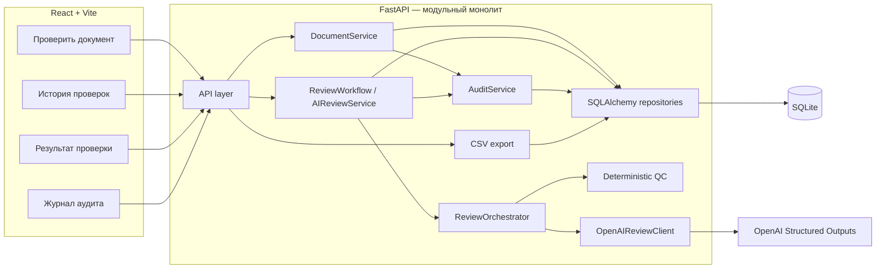
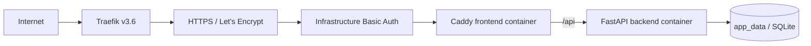

# Архитектура

## Назначение и пользователи

**AI Specification Review & Risk Assistant** проверяет технические спецификации,
проектные требования, feature request'ы, брифы на автоматизацию и бизнес-требования.
Система:

- выявляет риски, недостающие требования и противоречия;
- формирует вопросы клиенту и измеримые критерии приёмки;
- получает строгий структурированный ответ от LLM;
- применяет детерминированную backend-валидацию после ответа модели;
- отмечает сомнительные результаты через `needs_review=true`;
- записывает ключевые изменяющие операции в `audit_runs`;
- при техническом сбое возвращает безопасный fallback без выдуманных находок.

Основные пользователи MVP — аналитики, владельцы продукта и инженеры. Продукт не является
LegalTech-системой и не позиционируется как средство анализа договоров.

## Архитектурный стиль

Приложение реализовано как **модульный монолит**:

- один процесс FastAPI отвечает за API, прикладные сервисы, персистентность,
  LLM-вызовы, QC, аудит и экспорт;
- один React/Vite frontend обращается к API по HTTP;
- одна SQLite база содержит документы, проверки и записи аудита.

Этот стиль сохраняет атомарные границы проверки, валидации и аудита без микросервисов,
очередей и распределённых транзакций. Код разделён на модули, но backend остаётся
единым модулем развёртывания.

## Компоненты



## Полный workflow проверки документа

1. Пользователь создаёт документ через `POST /api/documents`.
2. FastAPI валидирует `title` и `text`, затем атомарно сохраняет `Document` со
   `status="created"` и `AuditRun(action="document.create")`.
3. Пользователь запускает `POST /api/documents/{document_id}/review`.
4. `ReviewWorkflow` читает текст документа, закрывает read-транзакцию и вызывает
   `ReviewOrchestrator` без открытой DB-транзакции.
5. `OpenAIReviewClient` вызывает Responses API с `text_format=ModelReviewDraft`,
   `store=False` и фиксированным русским system prompt.
6. После `status="completed"` SDK разбирает Structured Outputs. Pydantic отклоняет
   лишние поля, невалидные значения enum и пустые после trim обязательные строки.
7. Для валидного `ModelReviewDraft` deterministic QC строит `FinalReview`.
   `needs_review` и `review_reason_codes` задаёт только backend.
8. При типизированной ошибке LLM orchestrator строит безопасный fallback `FinalReview`.
9. Короткая write-транзакция повторно проверяет существование документа и атомарно
   сохраняет `Review`, новый `Document.status` и `AuditRun`.
10. Frontend переходит на `/reviews/:reviewId` и показывает исходный документ и
    структурированный результат.

`POST /api/ai/review` использует тот же путь LLM → `ModelReviewDraft` → QC →
`FinalReview`, но не создаёт `documents` и `reviews`: до ответа сохраняется только
`AuditRun(action="ai.review", entity_type=null, entity_id=null)`.

## Backend-модули

### Слой API

Роутеры в `backend/app/api/` публикуют `/api/*`, сопоставляют HTTP-статусы и вызывают
прикладные сервисы. Невалидные тела, параметры запроса/пути и UUID возвращают `422`.
Ответы review endpoint'ов содержат `FinalReview` в `review_json` и денормализованные
`confidence`, `readiness`, `needs_review`, `reason_codes`. Поле `model_needs_review`
наружу не передаётся.

### Конфигурация

`backend/app/config.py` читает `OPENAI_API_KEY`, `OPENAI_MODEL`, `DATABASE_URL` и
`BACKEND_CORS_ORIGINS` из окружения и корневого `.env`. Секреты не зашиты в код.
OpenAI SDK-клиент создаётся лениво только при вызове проверки.

### Персистентность

SQLAlchemy 2 работает с тремя таблицами: `documents`, `reviews`, `audit_runs`. Для
каждого SQLite-соединения выполняется:

```sql
PRAGMA foreign_keys = ON
```

Временные метки хранятся как канонические строки UTC ISO 8601 с `Z`. Подробности:
[DATA_MODEL.md](DATA_MODEL.md).

### LLM client и граница доверия

`OpenAIReviewClient` возвращает валидный `ModelReviewDraft` или типизированный
`LLMClientError`. Незавершённый ответ провайдера отклоняется до Structured Outputs
post-parser. Клиент не пишет в БД, не строит `FinalReview` и не принимает окончательное
решение `needs_review`.

Текст документа считается недоверенными данными: prompt требует игнорировать команды
внутри документа, не раскрывать prompt, не выдумывать факты и формировать текстовые
значения результата на русском языке.

### Детерминированный QC

Для успешно валидированного draft:

```text
deterministic_reason_codes = коды, условия которых подтверждены backend

final_needs_review =
  model_review_draft.model_needs_review
  OR len(deterministic_reason_codes) > 0

final_review.review_reason_codes = deterministic_reason_codes
```

Модель не возвращает reason codes, поэтому backend ничего не объединяет с модельным
списком. Failure-provenance коды `MODEL_ERROR`, `INVALID_JSON`, `SCHEMA_MISMATCH`
возникают только в fallback. Полный контракт: [REVIEW_SCHEMA.md](REVIEW_SCHEMA.md).

### Аудит

`AuditService` обеспечивает инвариант: при `status="error"` поле `error` содержит
непустое очищенное сообщение, а при `success` или `needs_review` равно `null`.
Снимки аудита хранят только безопасные метаданные, определённые в
[DATA_MODEL.md](DATA_MODEL.md): длины полей, UUID, литералы версий, fallback-флаг,
безопасную категорию и итоговые флаги. Полные `title`/`text`, `review_json`, ключи API,
ответ провайдера и трассировка не сохраняются.

### CSV-экспорт

`GET /api/reviews/export`, `GET /api/reviews/{review_id}/export` и
`GET /api/audit-runs/export` формируют UTF-8 с BOM, разделителем `;` и `\r\n`.
Экспорт использует те же фильтры и сортировку, что list endpoint, но без пагинации.
Каждая строковая ячейка защищается от formula injection. Экспорт доступен только для
чтения, не вызывает
LLM и не создаёт `audit_runs`.

## Реализованные разделы frontend

| Маршрут | Видимый раздел | Фактические возможности |
| --- | --- | --- |
| `/` | «Проверить документ» | Поля «Название документа» и «Текст документа»; действие «Сохранить документ и запустить проверку»; при повторе после ошибки не создаёт дубликат документа. |
| `/reviews` | «История проверок» | Сохранённые проверки; фильтры по ID документа и признаку экспертной проверки; пагинация; «Открыть результат»; «Скачать CSV». |
| `/reviews/:reviewId` | «Результат проверки» | Метаданные и `FinalReview`, исходный документ, техническое примечание при наличии, служебный `review_json`, «Скачать результат CSV». |
| `/audit` | «Журнал аудита» | Фильтр «Все записи» / «Успешно» / «Нужна экспертная проверка» / «Только ошибки», данные аудита и CSV. |
| `*` | «Страница не найдена» | Русскоязычная 404-страница с возвратом на главную. |

Frontend не реализует отдельный список документов, фильтр документов по `status` или
отдельную карточку документа. Исходный документ показывается только на странице
результата через `GET /api/documents/{document_id}`. Backend-эндпоинты списка и детали
документа при этом остаются частью публичного API.

## Транзакционные границы

| Операция | Правило |
| --- | --- |
| `document.create` | `Document` и `AuditRun` фиксируются атомарно. |
| Успешная сохранённая проверка | `Review`, `Document.status="reviewed"` и аудит со статусом `success` или `needs_review` фиксируются атомарно. |
| Сохранённый fallback | `Review.error`, `Document.status="review_failed"` и `AuditRun(status="error")` фиксируются атомарно; API возвращает `201`. |
| Пригодный `Review` сохранить нельзя | Основная транзакция откатывается; отдельная recovery-транзакция по возможности меняет статус документа и пишет аудит ошибки, затем исходное исключение пробрасывается дальше. |
| `ai.review` | Обычный или fallback-аудит фиксируется до HTTP-ответа. |
| CSV-экспорт | Доступен только для чтения; audit не создаётся ни при успехе, ни при ошибке. |

Recovery-транзакция — гарантия по возможности. Если база повторно отклоняет recovery
write/commit, её изменения полностью откатываются: статус документа остаётся прежним,
новый аудит отсутствует, а вызывающая сторона всё равно получает исходную ошибку.

## Матрица исходов проверки документа

| Исход | `Review.error` | `AuditRun.status` | `AuditRun.error` | `Document.status` |
| --- | --- | --- | --- | --- |
| `needs_review=false`, технического сбоя нет | `null` | `success` | `null` | `reviewed` |
| `needs_review=true`, технического сбоя нет | `null` | `needs_review` | `null` | `reviewed` |
| `used_fallback=true`, основная транзакция успешна | фиксированное очищенное сообщение | `error` | то же сообщение | `review_failed` |
| Пригодный `Review` отсутствует, recovery успешна | строки `Review` нет | `error` | фиксированное очищенное сообщение | `review_failed` |
| Пригодный `Review` отсутствует, recovery неуспешна | строки `Review` нет | новой записи нет | не применимо | прежний статус |

`needs_review=true` сам по себе не означает техническую ошибку. Технический fallback
определяется только по `used_fallback`.

## Production-развёртывание

Реальное развёртывание работает по адресу <https://spec-review.elivcloud.org>:



- Traefik подключает только `frontend` к внешней сети и направляет трафик на порт `80`
  Caddy.
- Caddy раздаёт SPA, выполняет fallback на `index.html` и проксирует `/api` на
  `backend:8000`.
- Backend не публикует порт хоста.
- `/app/data` подключён к именованному volume `app_data`; сохранность SQLite проверена
  после принудительного пересоздания backend-контейнера.
- HTTPS и сертификат обслуживает существующий Traefik/Let's Encrypt.
- Basic Auth реализована существующим Traefik middleware через
  `TRAEFIK_MIDDLEWARES`; credentials и hash находятся вне репозитория.

Прикладной аутентификации в приложении нет. Инфраструктурная Basic Auth защищает
развёртывание, но не создаёт пользователей, роли, сессии или изоляцию арендаторов и не
меняет границы продукта.

## Границы безопасности и исключения

- CORS ограничен настроенными origin'ами.
- `.env` и секреты не добавляются в Git и не копируются в образы.
- Вход — только обычный текст; обработка PDF/DOCX/OCR отсутствует.
- Backend-схема и QC — граница доверия для LLM-результата.
- Вне границ остаются прикладная аутентификация и роли, RAG/векторные базы данных,
  сравнение версий, переписывание спецификаций, интеграции с мессенджерами, совместная
  работа нескольких пользователей, микросервисы, Redis, очереди, Kubernetes и
  LegalTech-позиционирование.

Обязательной частью исходных границ был локальный MVP. Production-развёртывание было
необязательным следующим шагом и впоследствии было реализовано и проверено.
