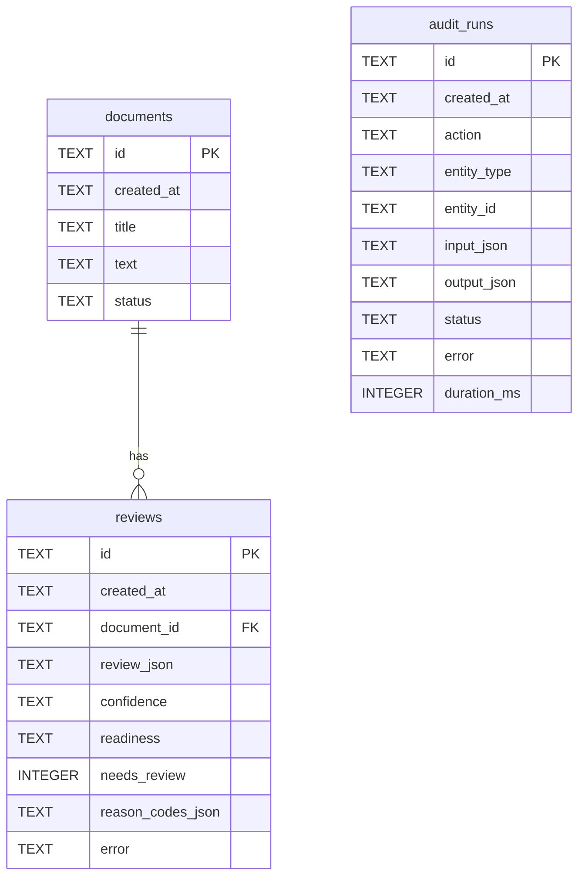

# Data Model

SQLite is the only datastore for the MVP. The schema contains exactly three tables: `documents`, `reviews`, and `audit_runs`.

Identifiers are stored as UUID strings (`TEXT`). JSON columns store UTF-8 JSON text.

## Connection requirements

Every database connection must enable foreign-key enforcement:

```sql
PRAGMA foreign_keys = ON
```

## Timestamp storage rule

Store every timestamp column as a **canonical UTC ISO 8601 string with a trailing `Z`** (example: `2026-08-04T18:30:00Z`).
API responses must use the same UTC representation. No alternative storage formats are permitted for the approved MVP.

## Enumerations

### DocumentStatus

| Value | Meaning |
| --- | --- |
| `created` | Document stored; no persisted review attempt yet |
| `reviewed` | The latest document-backed review attempt completed technically successfully (a review row was persisted with `error=null`), regardless of whether its *content* sets `needs_review=true` |
| `review_failed` | The latest document-backed review attempt did not complete a trustworthy automated review: either a safe fallback review row was persisted after a technical failure (`Review.error` non-null), or no usable review row could be persisted at all |

Each new document-backed review attempt re-sets `documents.status` from its own outcome: `reviewed` after a genuine success, `review_failed` after a fallback or a failed attempt — never left at `created` once a review has been attempted. For the "no usable review row could be persisted at all" case, this update is written by a separate, **best-effort recovery transaction** (see "Transaction boundaries (persistence)" below): if that recovery transaction itself fails (for example, a repeat database outage), `documents.status` is left at whatever value it already had before this attempt, not guaranteed to become `review_failed`.

### AuditStatus

| Value | Meaning |
| --- | --- |
| `success` | The action completed without a technical error and manual review is not required |
| `needs_review` | The model response was successfully parsed and validated, but the final deterministic result requires manual review |
| `error` | Model, transport, JSON parsing, schema validation, persistence, or export failure occurred, including cases where a safe fallback was returned or persisted |

Status / `error` field invariants (application-level validation; not separate columns or tables):

- when `audit_runs.status == "error"`, `audit_runs.error` must contain a non-empty sanitized error summary;
- when `audit_runs.status` is `"success"` or `"needs_review"`, `audit_runs.error` must be `null`;
- technical failures that return or persist a safe fallback still use `status="error"` with a non-null sanitized error summary;
- successfully parsed and validated reviews requiring human attention use `status="needs_review"` and `error=null`.

Inconsistent rows that violate these invariants must not be treated as valid data. Raw credentials, headers, tokens, stack traces containing secrets, and provider credentials must never be stored.

Confidence, document readiness, severity, categories, and review reason codes are defined in [REVIEW_SCHEMA.md](REVIEW_SCHEMA.md). `reviews.review_json` stores a backend-produced **`FinalReview`**. The untrusted OpenAI payload is a separate **`ModelReviewDraft`** and is not persisted in `review_json`.

---

## Table: `documents`

| Column | Type | Required | Nullable | Description |
| --- | --- | --- | --- | --- |
| `id` | `TEXT` (UUID) | yes | no | Primary key |
| `created_at` | `TEXT` (UTC ISO 8601 with `Z`) | yes | no | Creation timestamp |
| `title` | `TEXT` | yes | no | Document title |
| `text` | `TEXT` | yes | no | Full plain-text body |
| `status` | `TEXT` | yes | no | `DocumentStatus` value |

**Constraints:**

- `PRIMARY KEY (id)`
- `CHECK (status IN ('created', 'reviewed', 'review_failed'))`
- `title` and `text` must be non-empty after trim at insert time (enforced in application validation → HTTP `422`)

**Indexes:**

- `ix_documents_status` on `status`
- `ix_documents_created_at` on `created_at`

**Cascade behaviour:**

- Deleting a document deletes its dependent `reviews` rows (`ON DELETE CASCADE` from `reviews.document_id`).
- `audit_runs` are **not** cascaded from documents; audit rows are retained as an immutable operational log. `entity_id` may therefore reference a deleted entity.

---

## Table: `reviews`

| Column | Type | Required | Nullable | Description |
| --- | --- | --- | --- | --- |
| `id` | `TEXT` (UUID) | yes | no | Primary key |
| `created_at` | `TEXT` (UTC ISO 8601 with `Z`) | yes | no | Creation timestamp |
| `document_id` | `TEXT` (UUID) | yes | no | FK → `documents.id` |
| `review_json` | `TEXT` (JSON object) | yes | no | Full backend-produced `FinalReview` object |
| `confidence` | `TEXT` | yes | no | Denormalized `high` \| `medium` \| `low` |
| `readiness` | `TEXT` | yes | no | Denormalized `ready` \| `needs_clarification` \| `not_ready` |
| `needs_review` | `INTEGER` (boolean 0/1) | yes | no | Final backend decision from `FinalReview.needs_review` |
| `reason_codes_json` | `TEXT` (JSON array) | yes | no | Backend-produced `FinalReview.review_reason_codes` stored as JSON text |
| `error` | `TEXT` | no | yes | Error message when the pipeline recorded a failure context; otherwise `NULL` |

**Constraints:**

- `PRIMARY KEY (id)`
- `FOREIGN KEY (document_id) REFERENCES documents(id) ON DELETE CASCADE`
- `CHECK (confidence IN ('high', 'medium', 'low'))`
- `CHECK (readiness IN ('ready', 'needs_clarification', 'not_ready'))`
- `CHECK (needs_review IN (0, 1))`

**Indexes:**

- `ix_reviews_document_id` on `document_id`
- `ix_reviews_needs_review` on `needs_review`
- `ix_reviews_confidence` on `confidence`
- `ix_reviews_readiness` on `readiness`
- `ix_reviews_created_at` on `created_at`

**Cascade behaviour:**

- Child of `documents` with `ON DELETE CASCADE`.
- Does not own `audit_runs`.

**Denormalization rules:**

| Column | Must match |
| --- | --- |
| `confidence` | `review_json.confidence` |
| `readiness` | `review_json.document_readiness` |
| `needs_review` | `review_json.needs_review` (backend-produced `FinalReview` value) |
| `reason_codes_json` | `review_json.review_reason_codes` (backend-produced only) |

`model_needs_review` is never stored in any `reviews` column.

**API serialization:** the column `reason_codes_json` is exposed in all API responses as the native JSON array field `reason_codes`. Clients never receive the column name `reason_codes_json`. `review_json` is always a `FinalReview`; APIs never return a raw `ModelReviewDraft`.

---

## Table: `audit_runs`

| Column | Type | Required | Nullable | Description |
| --- | --- | --- | --- | --- |
| `id` | `TEXT` (UUID) | yes | no | Primary key |
| `created_at` | `TEXT` (UTC ISO 8601 with `Z`) | yes | no | Creation timestamp |
| `action` | `TEXT` | yes | no | Action name (for example `document.review`) |
| `entity_type` | `TEXT` | no | yes | Logical entity type (`document`, `review`); `NULL` when none |
| `entity_id` | `TEXT` (UUID) | no | yes | Entity UUID; `NULL` when none |
| `input_json` | `TEXT` (JSON) | no | yes | Sanitized input snapshot |
| `output_json` | `TEXT` (JSON) | no | yes | Sanitized output snapshot |
| `status` | `TEXT` | yes | no | `AuditStatus` value |
| `error` | `TEXT` | no | yes | Sanitized error summary; non-empty when `status="error"`; must be `NULL` when `status` is `"success"` or `"needs_review"` |
| `duration_ms` | `INTEGER` | yes | no | Operation duration in milliseconds; `>= 0` |

**Constraints:**

- `PRIMARY KEY (id)`
- `CHECK (status IN ('success', 'needs_review', 'error'))`
- `CHECK (duration_ms >= 0)`
- No foreign key to `documents` or `reviews` (audit log is independent)

**Application-level validation rules** (enforced in application code; do not add a new table or column):

- if `status == "error"` then `error` is a non-empty sanitized string;
- if `status` is `"success"` or `"needs_review"` then `error` is `NULL`;
- rows that violate these invariants are invalid and must not be written.

**Indexes:**

- `ix_audit_runs_status` on `status`
- `ix_audit_runs_action` on `action`
- `ix_audit_runs_created_at` on `created_at`
- `ix_audit_runs_entity` on (`entity_type`, `entity_id`)

**Cascade behaviour:**

- None toward or from domain tables. Audit rows are append-only for the MVP (no update/delete API).

### Entity mapping

| Action | `entity_type` | `entity_id` |
| --- | --- | --- |
| `document.create` | `document` | created document id |
| `document.review` (successful or fallback-persisted) | `review` | created review id |
| `document.review` (failure before a review exists) | `document` | document id |
| `review.export` | `review` | review id |
| `ai.review` | `NULL` | `NULL` |

### AI-invoking reproducibility metadata

Every AI-invoking audit snapshot (`document.review` and `ai.review`) records these application constants inside `input_json` or `output_json`, together with the configured model name. They are **not** database columns:

```text
prompt_version = "spec-review-prompt-v1"
review_schema_version = "spec-review-schema-v1"
```

Later prompt or schema changes require a new version literal. Previous version strings must not be silently reused after a material prompt or schema change.

---

## Foreign-key relationship

- `reviews.document_id` → `documents.id` (`ON DELETE CASCADE`), enforced only when `PRAGMA foreign_keys = ON`
- `audit_runs` has no FK relationships

One document may have multiple reviews over time. The MVP does not add a separate “latest review” table; the application may select the latest by `created_at DESC`, then `id DESC`, when needed.

## Transaction boundaries (persistence)

| Scenario | Rule |
| --- | --- |
| `document.create` | Document and audit row committed atomically |
| Successful document-backed review | Review row, document status `reviewed`, and audit row committed atomically |
| Persisted safe fallback | Fallback review (`Review.error` non-null), document status `review_failed`, and error audit row (`audit_runs.error` non-null) committed atomically. This is the main persistence transaction succeeding — not the recovery path below — so it carries no best-effort caveat: a successfully committed fallback unconditionally has all three. |
| No usable review can be stored | Roll back the failed main persistence transaction first — this atomically discards any partially-prepared `Document`/`Review`/`AuditRun` changes from that attempt, so no partial state from it survives. Then attempt a separate **recovery transaction** that tries to set `document.status="review_failed"` and write one error `AuditRun` row. This recovery write is **best-effort**, not guaranteed — if the recovery transaction's own commit also fails (for example, the database is itself unavailable), its changes are rolled back in full — no partial `Document.status` update and no partial/duplicate `AuditRun` row are left behind — and `documents.status` simply keeps whatever value it already had before this attempt (`created`, or `reviewed`/`review_failed` from an earlier attempt on the same document), with no new `AuditRun` row for this attempt. |
| Required audit cannot be stored | Audited action must not be reported as successful |

The best-effort caveat above applies only to the recovery transaction in the "no usable review can be stored" row. It does not weaken any other row in this table: `document.create`, a successful document-backed review, and a persisted safe fallback are each still committed atomically as their own single (non-recovery) transaction, with no best-effort qualifier.

## JSON serialization rules

1. JSON columns (`review_json`, `reason_codes_json`, `input_json`, `output_json`) store compact UTF-8 JSON text.
2. Objects and arrays must be valid JSON; never store Python/`None` literals or trailing commas.
3. Booleans in JSON are `true` / `false`; SQLite `needs_review` uses `0` / `1`.
4. `reason_codes_json` is always a JSON array (possibly empty `[]`), never a bare string.
5. `review_json` must satisfy the `FinalReview` schema in [REVIEW_SCHEMA.md](REVIEW_SCHEMA.md) when a review row is persisted, including safe fallbacks. It must never store a raw `ModelReviewDraft`.
6. `null` JSON values are allowed only where the review schema permits (`evidence` on risks may be `null`).
7. API responses parse these columns back to native JSON objects/arrays; clients never receive double-encoded JSON strings for object fields.
8. API field name for reason codes is always `reason_codes`; only the SQLite column is named `reason_codes_json`.
9. `reason_codes_json` stores backend-produced `FinalReview.review_reason_codes` only; the model never supplies reason codes.

## Data that must never be written to audit logs

Audit `input_json` / `output_json` / `error` must **never** contain:

- API keys, tokens, passwords, or `.env` secret values;
- `Authorization` or cookie header values;
- private TLS material or connection strings that embed credentials;
- full raw upstream provider credentials or signing secrets;
- stack traces containing secrets.

Document title/text and review payloads are allowed in audit snapshots for operational diagnosis, subject to the local/trusted-network MVP threat model. Do not add extra PII redaction tables in this schema.

## ER diagram



No other tables are part of the approved MVP data model.
