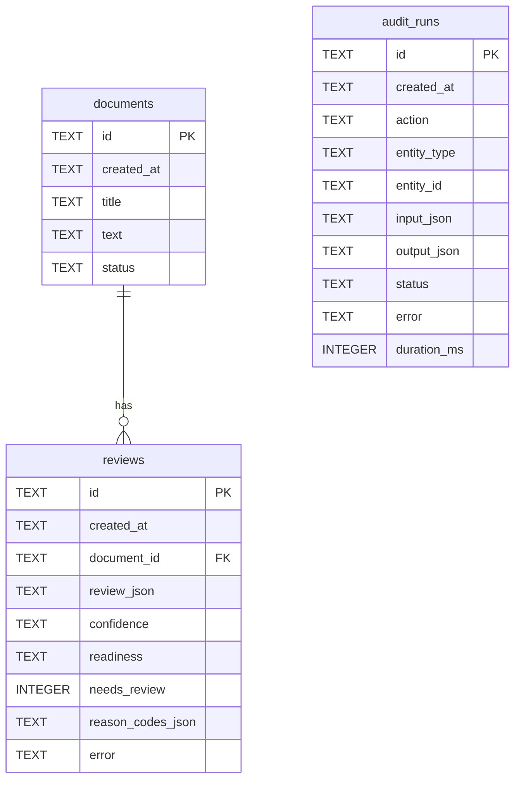

# Модель данных

SQLite — единственное хранилище MVP. Схема содержит ровно три таблицы:
`documents`, `reviews`, `audit_runs`. Идентификаторы хранятся как UUID-строки в
`TEXT`, JSON-поля — как UTF-8-текст JSON.

## Требования к соединению

Каждое соединение включает внешние ключи:

```sql
PRAGMA foreign_keys = ON
```

## Временные метки

Все колонки временных меток хранят канонические значения UTC ISO 8601 с завершающим `Z`, например
`2026-08-04T18:30:00Z`. API возвращает тот же формат.

## Значения enum

### `DocumentStatus`

| Значение | Смысл |
| --- | --- |
| `created` | Документ сохранён; сохранённой попытки проверки ещё нет. |
| `reviewed` | Последняя document-backed проверка завершилась технически успешно и сохранила `Review.error=null`, независимо от `needs_review`. |
| `review_failed` | Последняя попытка не дала доверенной автоматической проверки: сохранён fallback с непустым `Review.error` либо пригодный `Review` сохранить не удалось. |

Каждая новая попытка выставляет статус по собственному исходу. После успешной повторной
проверки документ может перейти из `review_failed` в `reviewed`. Если не удалось
сохранить пригодный `Review`, `review_failed` выставляет отдельная recovery-транзакция;
при сбое самой recovery-транзакции прежний статус остаётся неизменным.

### `AuditStatus`

| Значение | Смысл |
| --- | --- |
| `success` | Операция завершена без технической ошибки, экспертная проверка не нужна. |
| `needs_review` | Ответ модели успешно разобран и валидирован, но итог требует экспертной проверки. |
| `error` | Произошёл сбой модели, транспорта, JSON, схемы или персистентности, включая сохранённый/возвращённый fallback. |

Инварианты application layer:

- при `status == "error"` поле `error` — непустая очищенная строка;
- при `status` равном `success` или `needs_review` поле `error` — `null`;
- несогласованные строки не должны записываться или считаться валидными.

`confidence`, `document_readiness`, severity, category и reason codes проверки определены
в [REVIEW_SCHEMA.md](REVIEW_SCHEMA.md).

## Таблица `documents`

| Колонка | Тип | Обязательна | Nullable | Описание |
| --- | --- | --- | --- | --- |
| `id` | `TEXT` (UUID) | да | нет | Первичный ключ. |
| `created_at` | `TEXT` | да | нет | UTC ISO 8601 с `Z`. |
| `title` | `TEXT` | да | нет | Название документа. |
| `text` | `TEXT` | да | нет | Полный plain-text документ. |
| `status` | `TEXT` | да | нет | Значение `DocumentStatus`. |

Ограничения:

- `PRIMARY KEY (id)`;
- `CHECK (status IN ('created', 'reviewed', 'review_failed'))`;
- `title` и `text` должны быть непустыми после trim; это обеспечивает Pydantic до
  записи и возвращает HTTP `422`.

Индексы:

- `ix_documents_status` по `status`;
- `ix_documents_created_at` по `created_at`.

Удаление документа каскадно удаляет его `reviews` через `ON DELETE CASCADE`.
`audit_runs` не удаляются и могут после этого ссылаться на отсутствующую логическую сущность.

## Таблица `reviews`

| Колонка | Тип | Обязательна | Nullable | Описание |
| --- | --- | --- | --- | --- |
| `id` | `TEXT` (UUID) | да | нет | Первичный ключ. |
| `created_at` | `TEXT` | да | нет | UTC ISO 8601 с `Z`. |
| `document_id` | `TEXT` (UUID) | да | нет | FK → `documents.id`. |
| `review_json` | `TEXT` (JSON object) | да | нет | Полный `FinalReview`, созданный backend. |
| `confidence` | `TEXT` | да | нет | `high` \| `medium` \| `low`. |
| `readiness` | `TEXT` | да | нет | `ready` \| `needs_clarification` \| `not_ready`. |
| `needs_review` | `INTEGER` (0/1) | да | нет | Итоговое backend-решение. |
| `reason_codes_json` | `TEXT` (JSON array) | да | нет | `FinalReview.review_reason_codes`. |
| `error` | `TEXT` | нет | да | Фиксированное очищенное сообщение для сохранённого fallback; иначе `NULL`. |

Ограничения:

- `PRIMARY KEY (id)`;
- `FOREIGN KEY (document_id) REFERENCES documents(id) ON DELETE CASCADE`;
- `CHECK (confidence IN ('high', 'medium', 'low'))`;
- `CHECK (readiness IN ('ready', 'needs_clarification', 'not_ready'))`;
- `CHECK (needs_review IN (0, 1))`.

Индексы: `ix_reviews_document_id`, `ix_reviews_needs_review`,
`ix_reviews_confidence`, `ix_reviews_readiness`, `ix_reviews_created_at`.

Правила денормализации:

| Колонка | Должна совпадать с |
| --- | --- |
| `confidence` | `review_json.confidence` |
| `readiness` | `review_json.document_readiness` |
| `needs_review` | `review_json.needs_review` |
| `reason_codes_json` | `review_json.review_reason_codes` |

`model_needs_review` не хранится ни в одной review-колонке. API преобразует
`reason_codes_json` в обычный массив JSON `reason_codes`; имя SQLite-колонки клиенту не
передаётся. `review_json` всегда содержит `FinalReview`, никогда `ModelReviewDraft`.

## Таблица `audit_runs`

| Колонка | Тип | Обязательна | Nullable | Описание |
| --- | --- | --- | --- | --- |
| `id` | `TEXT` (UUID) | да | нет | Первичный ключ. |
| `created_at` | `TEXT` | да | нет | UTC ISO 8601 с `Z`. |
| `action` | `TEXT` | да | нет | Имя операции, например `document.review`. |
| `entity_type` | `TEXT` | нет | да | `document`, `review` или `NULL`. |
| `entity_id` | `TEXT` (UUID) | нет | да | UUID логической сущности или `NULL`. |
| `input_json` | `TEXT` (JSON) | нет | да | Очищенный снимок входных данных. |
| `output_json` | `TEXT` (JSON) | нет | да | Очищенный снимок результата. |
| `status` | `TEXT` | да | нет | Значение `AuditStatus`. |
| `error` | `TEXT` | нет | да | Очищенное сообщение; непустое только при `status="error"`. |
| `duration_ms` | `INTEGER` | да | нет | Длительность операции, `>= 0`. |

Ограничения:

- `PRIMARY KEY (id)`;
- `CHECK (status IN ('success', 'needs_review', 'error'))`;
- `CHECK (duration_ms >= 0)`;
- внешних ключей к domain tables нет.

Индексы: `ix_audit_runs_status`, `ix_audit_runs_action`,
`ix_audit_runs_created_at`, составной `ix_audit_runs_entity` по
`(entity_type, entity_id)`.

Журнал аудита доступен только для добавления на уровне публичного API: эндпоинтов
обновления и удаления нет.

### Связь с сущностями

| Операция | `entity_type` | `entity_id` |
| --- | --- | --- |
| `document.create` | `document` | ID созданного документа |
| `document.review`, `Review` сохранён | `review` | ID созданной проверки |
| `document.review`, `Review` не создан | `document` | ID документа |
| `ai.review` | `NULL` | `NULL` |

CSV-эндпоинты записи аудита не создают.

### Точная структура данных аудита

Реализация намеренно не пишет в снимки аудита полные `title`, текст документа,
`review_json` или сырое содержимое ответа модели.

#### `document.create`

```json
{
  "input_json": {
    "title_length": 24,
    "text_length": 850
  },
  "output_json": {
    "document_id": "uuid",
    "status": "created"
  }
}
```

#### `document.review` — сохранённый успех или fallback

```json
{
  "input_json": {
    "document_id": "uuid",
    "prompt_version": "spec-review-prompt-v2",
    "review_schema_version": "spec-review-schema-v1"
  },
  "output_json": {
    "review_id": "uuid",
    "used_fallback": false,
    "llm_error_category": null
  }
}
```

При fallback `used_fallback=true`, а `llm_error_category` содержит одно из значений
`LLMErrorCategory`. Аудит этой операции не содержит полного `FinalReview`,
`review_reason_codes`, текста документа или настроенного имени модели.

#### `document.review` — recovery после непредвиденного сбоя

`input_json` содержит `document_id`, `prompt_version`, `review_schema_version` в той же
форме; `output_json=null`. `entity_type="document"`, `entity_id` равен ID документа.

#### `ai.review` — обычный или fallback ответ

```json
{
  "input_json": {
    "title_length": 24,
    "text_length": 850,
    "prompt_version": "spec-review-prompt-v2",
    "review_schema_version": "spec-review-schema-v1",
    "model": "configured-model-name"
  },
  "output_json": {
    "used_fallback": false,
    "llm_error_category": null,
    "needs_review": false,
    "review_reason_codes": []
  }
}
```

Если `title` опущен, `title_length=null`. Если имя модели пусто, `model=null`. При
fallback меняются флаги, категория и reason codes, но полный текст и `FinalReview` не
добавляются.

#### `ai.review` — recovery после непредвиденного сбоя

`input_json` имеет ту же структуру с длинами/version/model, `output_json=null`, оба
entity-поля равны `NULL`.

В `error` всегда записывается только одно из фиксированных русских сообщений для
пользователя, а не `str(exc)`, трассировка или ответ провайдера.

## Связи

- `reviews.document_id` → `documents.id` с `ON DELETE CASCADE`;
- `audit_runs` не имеет FK;
- у одного документа может быть несколько проверок;
- отдельной таблицы «последней проверки» нет; при необходимости используется
  `created_at DESC`, затем `id DESC`.

## Транзакционные границы

| Сценарий | Правило |
| --- | --- |
| `document.create` | `Document` и аудит фиксируются атомарно. |
| Успешный `document.review` | `Review`, `Document.status="reviewed"` и аудит фиксируются атомарно. |
| Сохранённый fallback | `Review.error`, `Document.status="review_failed"` и аудит ошибки фиксируются атомарно. |
| Пригодный `Review` сохранить нельзя | Основная транзакция полностью откатывается; отдельная recovery-транзакция пытается атомарно обновить статус и создать аудит ошибки. |
| Фиксация recovery неуспешна | Оба recovery-изменения откатываются; прежний статус остаётся, новой записи аудита нет, исходная ошибка сохраняется. |
| Обязательный аудит не сохраняется | Операция не возвращается как успешная. |

Оговорка «по возможности» относится только к recovery после отсутствия пригодного
`Review`; она не ослабляет атомарность создания документа, обычной проверки или
сохранённого fallback.

## JSON-сериализация

1. `review_json`, `reason_codes_json`, `input_json`, `output_json` содержат валидный
   компактный UTF-8 JSON.
2. Логические значения JSON — `true`/`false`; SQLite `needs_review` — `0`/`1`.
3. `reason_codes_json` всегда массив, включая `[]`.
4. `review_json` проходит схему `FinalReview`; необработанный `ModelReviewDraft` не сохраняется.
5. JSON `null` допустим только там, где это позволяет контракт; например,
   `risks[].evidence` может быть `null`.
6. API десериализует JSON-колонки в обычные объекты/массивы и не возвращает строки JSON
   с двойным кодированием.

## Данные, запрещённые в журнале аудита

В `input_json`, `output_json` и `error` нельзя записывать:

- ключи API, токены, пароли и значения секретных переменных;
- `Authorization` и cookie headers;
- закрытые материалы TLS и строки соединения с учётными данными;
- полные title/text документов;
- полный `review_json`, необработанный ответ модели/провайдера;
- сообщение исключения и трассировку.

## ER-диаграмма



Других таблиц в утверждённой модели данных нет.
